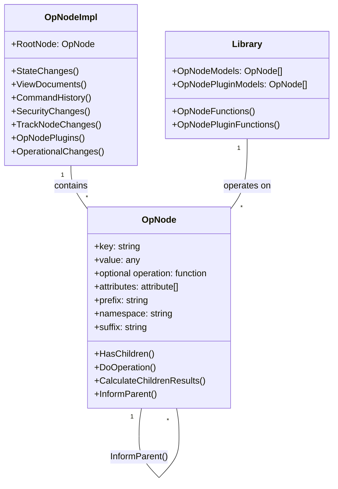
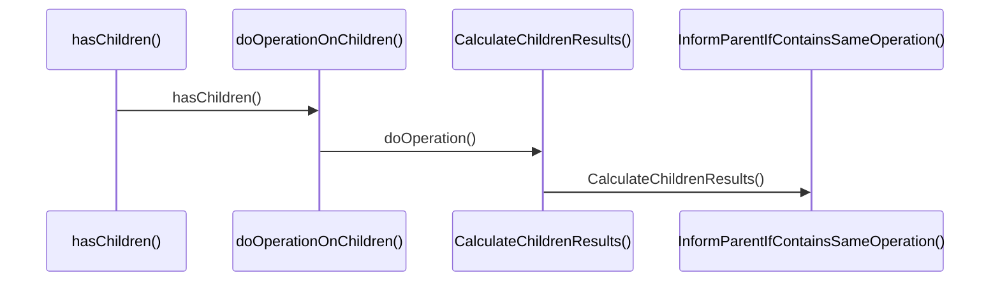

# OpNode - Tree Based Couch DB with a Simple Operations Interface

## Introduction

OpNode is a versatile and powerful tree-based system for managing key-value pairs using a TreeView structure. The project aims to provide a user-friendly interface for operations on individual tree nodes, with a wide range of potential applications such as password management, data organization, and more.  Operations are optional functionality that is added to OpNode which supports importing and exporting XML files, searching node structures, and executing commands on individual nodes.

## Basic sequence of all Operations (Operations are always optional)

## Special Features

- **TreeView-based key-value pair management:** Easily organize and manage data in a hierarchical structure.
- **Importing and exporting XML files:** Seamlessly integrate with XML-based data sources or export your data in a widely-supported format.
- **Search functionality within node structures:** Quickly locate specific nodes by searching for keywords.
- **Extensible operations on individual nodes:** Customize and expand the functionality of each node with various operations.
- **Child Node Operations:** Child nodes with a parent that contains an operation can optionally contain the same operation or different operations.
- **Integration with JSON and XML as a tree-spanning database:** Leverage the power of NoSQL for a more robust and scalable data storage solution.
- **Support for XML, JSON, JSON Schema, and XML Schema operations:** Gain flexibility and control over data management with support for popular data formats and schemas.

## Getting Started

### Requirements

- Visual Studio 2022 or later

### Setup

1. Clone the repository: `git clone https://github.com/UserLevelUp/OpNode.git`
2. Open the solution file (`.sln`) in the PWord4 project using Visual Studio
3. Set the startup project to MyPword
4. Build and run the solution

## How to Contribute

We welcome contributions from developers of all skill levels. To get started, follow these steps:

1. Fork the repository and create a new branch based on the master branch
2. Make your changes, additions, or improvements to the code
3. Submit a pull/merge request with a clear description of your changes
4. Please avoid submitting spammy or low-quality pull requests

For more complex tasks or feature requests, please create an issue or request one to be added. We will organize issues into milestones for easier management.

## Support and Community

We aim to create a welcoming, inclusive, and supportive community around OpNode. If you have questions, need assistance, or want to offer help, feel free to reach out through our communication channels, such as chat platforms or forums. We are also open to collaborations with other open-source projects, educational institutions, or organizations.

## Future Goals and Improvements

Some of the planned improvements and features for OpNode include:

- Optimizing and modernizing file saving and serialization
- Enhancing the command prompt functionality and integration
- Adding undo and redo functionality for the history
- Implementing multithreading for improved performance
- Creating an installer using Wix or another open-source solution

## Acknowledgements

Thank you to all the contributors who have helped make OpNode what it is today. Your efforts are greatly appreciated.

## License

OpNode is an open-source project, licensed under Apache 2 License.
